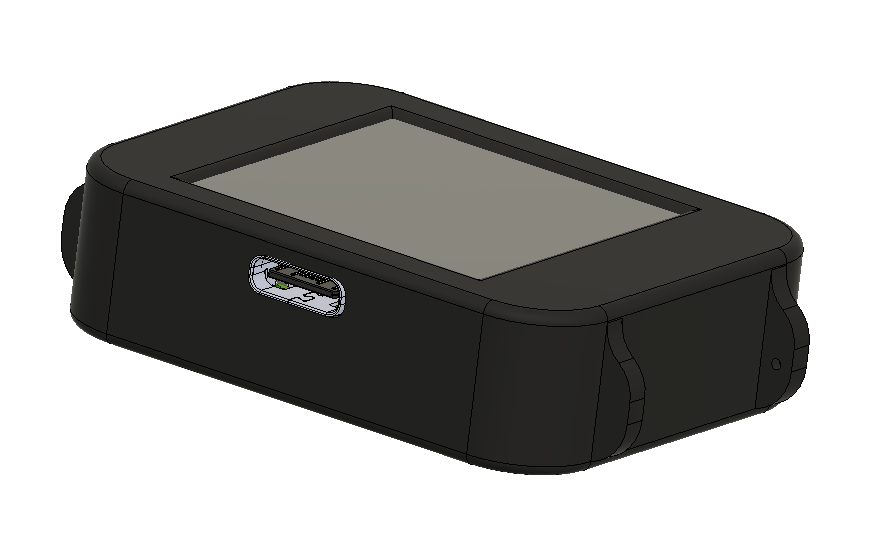
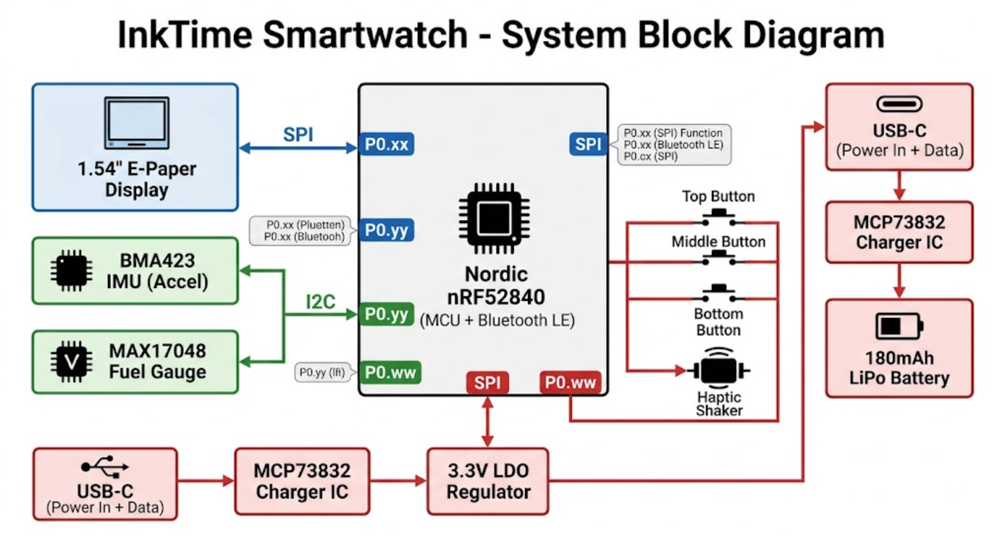
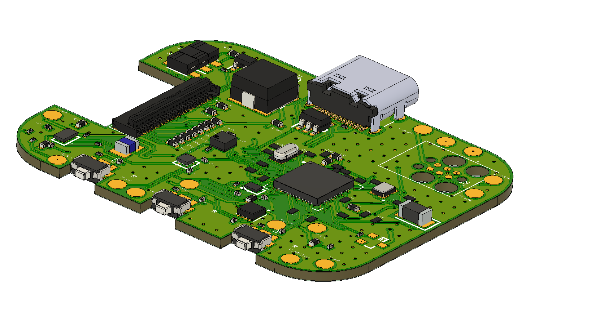

# InkTime - Open Source Smartwatch

InkTime is a low-cost, open-source smartwatch designed for the **EVT (Engineering Validation Test)** phase. This project involves the full hardware design cycle, from schematic capture and PCB layout in Autodesk Fusion 360 to mechanical integration and manufacturing file generation.

  

## Project Overview

The system architecture centers around the **nRF52840** (Nordic Semiconductor) for BLE connectivity and ultra-low power consumption, paired with a high-contrast E-Paper display.

### Key Features
- **MCU:** Nordic nRF52840 (Cortex-M4 + BLE 5.0).
- **Display:** 1.54" E-Paper (Ultra-low power, sunlight readable).
- **Power:** USB-C charging with 180mAh LiPo battery.
- **Form Factor:** Compact design ready for mechanical integration.

---

## System Architecture

### Block Diagram

  

The core of the device integrates high-speed SPI for the display and I2C for peripheral sensors.

### Hardware Functionality
- **Microcontroller:** The nRF52840 provides a 2.4GHz radio and ARM® Cortex®-M4 processor.
- **Interfaces:**
  - **SPI:** Dedicated for the E-Ink display to ensure high-speed data transfer.
  - **I2C:** Connects the IMU (Inertial Measurement Unit) and Fuel Gauge for battery monitoring.
  - **GPIO:** Used for tactile buttons and the haptic shaker motor (PWM controlled).
- **Power System:** Charged via USB-C (5V), regulated to 3.3V via a low-dropout (LDO) regulator.

---

## Bill of Materials (BOM)

| Component | Value/Model | Package | Provider (JLC) | Datasheet |
| :--- | :--- | :--- | :--- | :--- |
| **MCU** | nRF52840a | QFN™73 | [JLC Part](https://jlcpcb.com/) | [Link](https://infocenter.nordicsemi.com/pdf/nRF52840_PS_v1.1.pdf) |
| **Display** | E-Paper 1.54" | FPC | [JLC Part](https://jlcpcb.com/) | [Link](#) |
| **Charger IC** | MCP73832 | SOT-23-5 | [JLC Part](https://jlcpcb.com/) | [Link](https://ww1.microchip.com/downloads/en/DeviceDoc/20001984g.pdf) |
| **Battery** | LiPo 180mAh | Custom | N/A | [Link](#) |
| **LDO** | 3.3V Regulator | SOT-23 | [JLC Part](https://jlcpcb.com/) | [Link](#) |

---

## Pinout Mapping

| nRF52840 Pin | Function | Description |
| :--- | :--- | :--- |
| **P0.xx** | SPI_SCK | Serial Clock for E-Ink |
| **P0.yy** | SPI_MOSI | Master Out Slave In for E-Ink |
| **P0.zz** | I2C_SDA | Data line for Sensors |
| **P0.ww** | PWM_VIB | Haptic motor control |

---

## Energy Budget

- **Battery Capacity:** 180 mAh.
- **Deep Sleep Mode:** Estimated < 50 µA.
- **Active Refresh:** ~8-12 mA (peak during E-Ink refresh).
- **Estimated Standby:** Approx. 10-14 days.

---

## Design Log & Constraints

### PCB Implementation
- **Layers:** 2-layer design (Top/Bottom) with dedicated ground planes.
- **Trace Widths:** Power (0.3mm), Signal (0.15mm) to comply with JLC manufacturing standards.
- **Decoupling:** 100nF capacitors (0201) placed close to MCU VCC pins.

  

